1) Figure out why LE is unstable when it converges. Do the interactive plotting.

LE
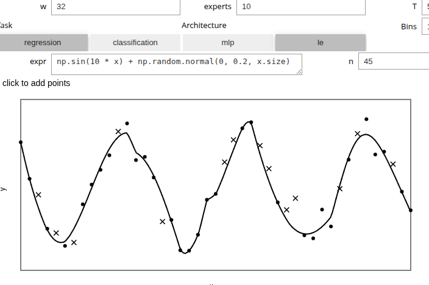

MLP
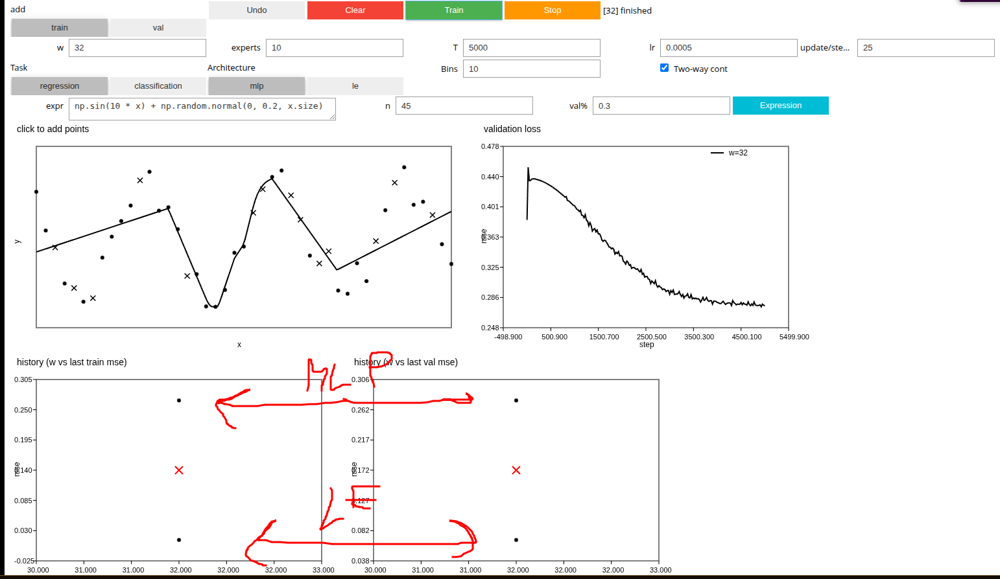


Comparison between DE, LE, MLP with the same number of params
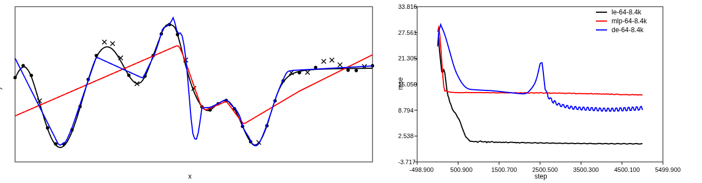

MLP - underfit; DE - weird lines poking out; LE - beautiful fit

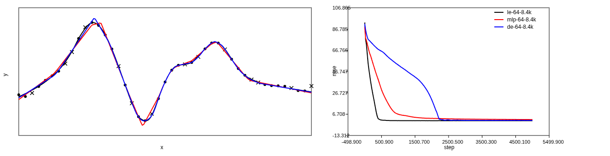

Somtimes they all fit very good, let's add noise and see  what happens.

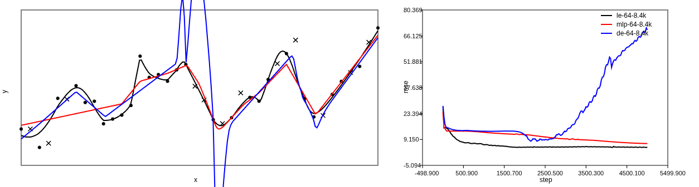

DE - goes stupid

2) Determine the simple/difficult regions.

Done look at the code

3) Launch LE on it.

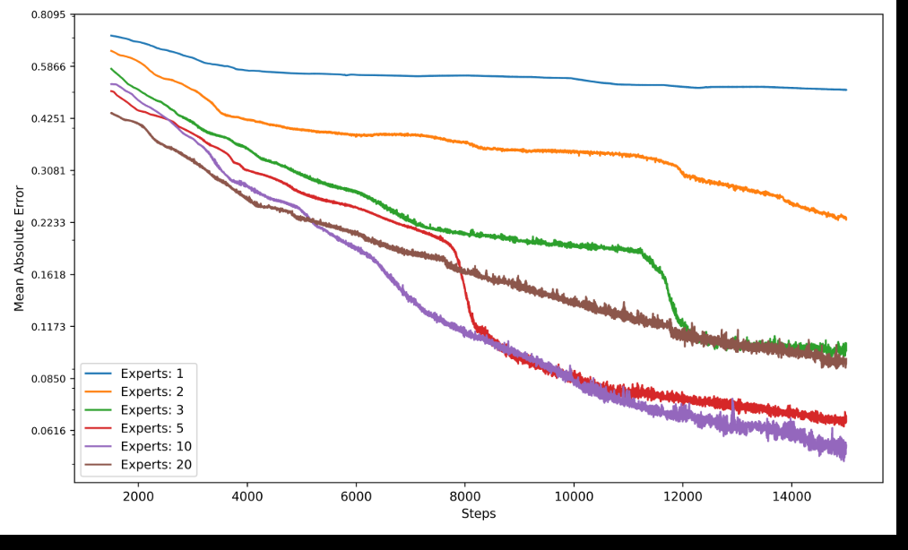

The composite function is this:
```python
def composite_function(plot=False):
    key = jax.random.key(123)
    n_linear_samples = 10
    composer = FuncComposer()
    y = composer.add(
        "linear", (-1, -0.6), n_linear_samples
    ).add(
        "fourier", (-0.6, 0), sigma=15.0, num_samples=40
    ).add(
        "linear", (0, 0.3), n_linear_samples
    ).add(
        "fourier", (0.3, 0.8), sigma=5, num_samples=20
    ).add(
        "linear", (0.8, 1), n_linear_samples
    ).compose(key)
```

10 Expert solve it the best, I am not super happy that 20 export perform worse (since this is training error).

Now let's see how many experts are used per sample

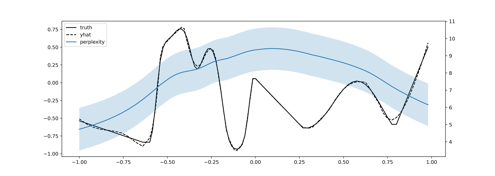
This is with no specialization loss and with load loss 1e-1

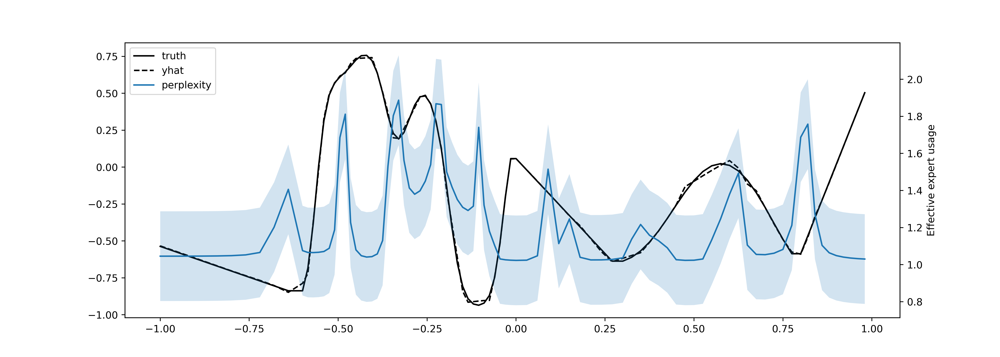
This is with specialization loss = 1e-2 with load loss 1e-1


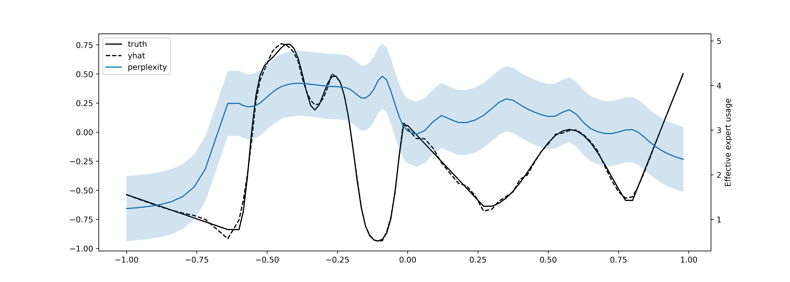
Specialization loss = 1e-3 with load loss 1e-1

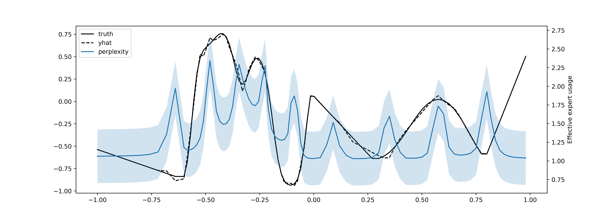
Specialization loss = 5e-3 with load loss 1e-1

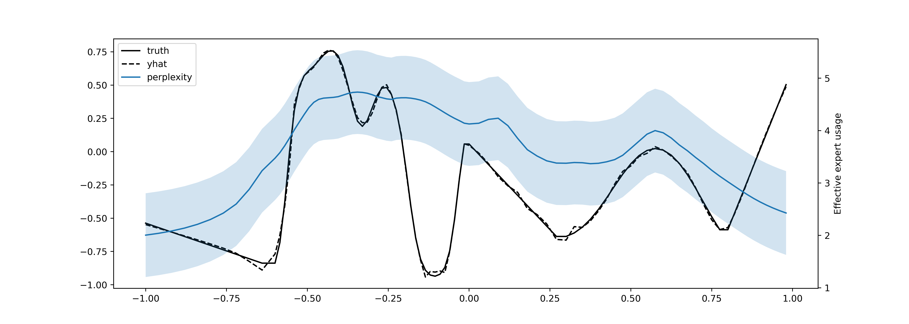
Specialization loss = 5e-4 and  load loss = 1e-2 seems kinda nice

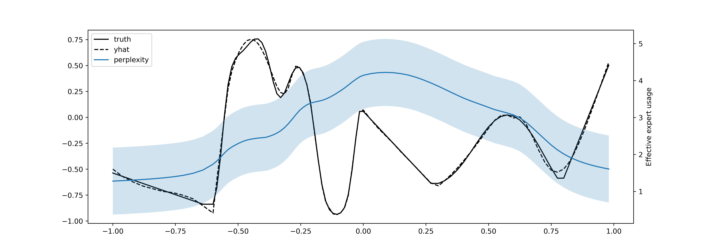
Specialization loss = 1e-4 and no load loss
